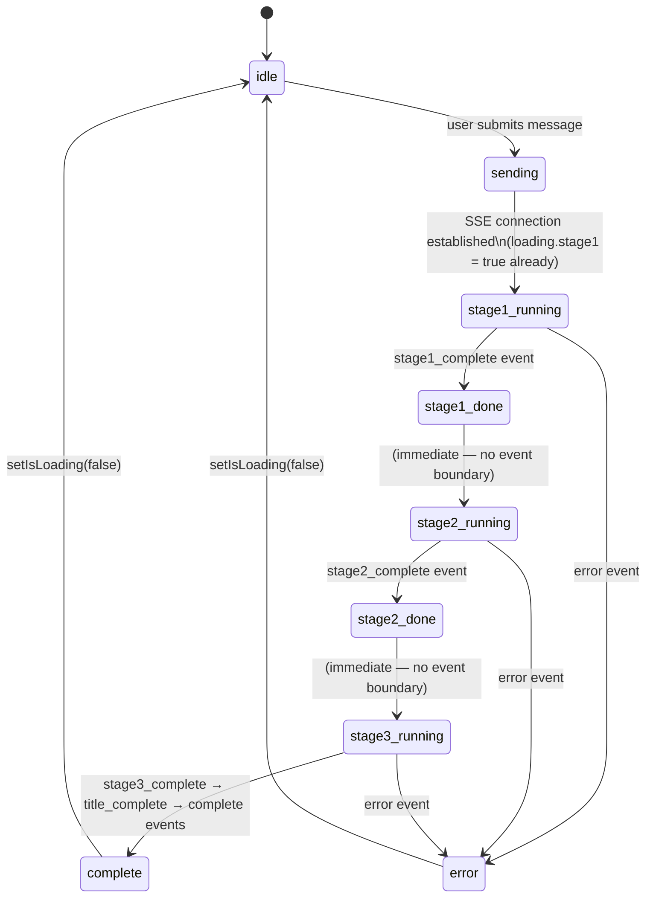

# LLM Council — Pipeline State Machine

This document describes the full lifecycle of a single message — from the user pressing
Enter to the final UI update — covering backend stages, SSE events, and frontend state
transitions.

---

## States

| State | Where | Description |
|-------|-------|-------------|
| `idle` | frontend | No message in flight; input enabled |
| `sending` | frontend | User message added to UI; assistant placeholder created; SSE connection open |
| `stage1_running` | backend + frontend | Council models generating answers in parallel |
| `stage1_done` | backend + frontend | All stage 1 results received; peer-review beginning |
| `stage2_running` | backend + frontend | All models peer-reviewing concurrently |
| `stage2_done` | backend + frontend | Rankings and Kendall's W computed |
| `stage3_running` | backend + frontend | Chairman model synthesising final answer |
| `complete` | frontend | All stages done; title saved; input re-enabled |
| `error` | frontend | Pipeline failed at any stage; input re-enabled |

---

## State diagram



---

## SSE event → state transition map

| SSE event | Backend trigger | Frontend handler | State after |
|-----------|----------------|-----------------|-------------|
| *(connection open)* | SSE headers sent | assistant placeholder added; `loading.stage1=true` | `stage1_running` |
| `stage1_complete` | `runStage1` done | `msg.stage1 = data`; `loading.stage1 = false` | `stage1_done` / `stage2_running` |
| `stage2_complete` | `runStage2` + rankings done | `msg.stage2 = data`; `msg.metadata = metadata`; `loading.stage2 = false` | `stage2_done` / `stage3_running` |
| `stage3_complete` | `runStage3` done | `msg.stage3 = data`; `loading.stage3 = false` | `stage3_running` → done |
| `title_complete` | title goroutine done | `loadConversations()` (sidebar refresh) | *(no stage change)* |
| `complete` | stream end | `loadConversations()`; `setIsLoading(false)` | `complete` → `idle` |
| `error` | any stage failure | `msg.error = message`; all `loading.*` → `false`; `setIsLoading(false)` | `error` → `idle` |

The backend emits **only `*_complete` events** — there are no `*_start` events emitted
over the wire. The frontend handles `stage1_start`, `stage2_start`, and `stage3_start` in
its SSE handler map, but these never arrive; they are dead code preserved for a possible
future protocol extension.

---

## Frontend loading flags

The assistant message in `App.jsx` carries three boolean flags that drive UI rendering:

```js
loading: {
  stage1: true,   // initial value — true before any SSE event
  stage2: false,
  stage3: false,
}
```

### Why `loading.stage1` starts as `true`

The backend does not emit a `stage1_start` event. Without pre-initialising `loading.stage1`
to `true`, the Stage 1 accordion would render nothing during the several seconds while
council models are running — making the UI appear frozen. Setting `true` at creation time
means the spinner appears immediately on message send, before the SSE connection even
delivers its first byte.

### Flag → UI mapping

| Flag | `true` | `false` (with data) | `false` (no data) |
|------|--------|--------------------|--------------------|
| `loading.stage1` | Stage1: spinner + "Collecting individual responses…" | Stage1: accordion header with model count | Stage1: hidden (`null`) |
| `loading.stage2` | Stage2: spinner header | Stage2: rankings + consensus badge | Stage2: hidden |
| `loading.stage3` | ChatInterface: `<div class="stage-loading">` spinner | Stage3: hero card (always expanded) | Stage3: hidden |

---

## Assistant message shape at each state

```js
// State: sending (just created — before any SSE event)
{
  role: 'assistant',
  stage1: null,    stage2: null,    stage3: null,    metadata: null,
  loading: { stage1: true, stage2: false, stage3: false },
  error: null,
}

// State: stage1_done (after stage1_complete)
{
  stage1: [ { label, content, model, duration_ms }, … ],
  loading: { stage1: false, stage2: false, stage3: false },
  // stage2, stage3, metadata still null
}

// State: stage2_done (after stage2_complete)
{
  stage1: […],
  stage2: [ { reviewer_label, rankings }, … ],
  metadata: { council_type, label_to_model, aggregate_rankings, consensus_w },
  loading: { stage1: false, stage2: false, stage3: false },
  // stage3 still null
}

// State: complete (after stage3_complete)
{
  stage1: […],
  stage2: […],
  stage3: { content, model, duration_ms },
  metadata: { … },
  loading: { stage1: false, stage2: false, stage3: false },
  error: null,
}

// State: error (at any stage)
{
  stage1: null | […],   // populated if stage1_complete arrived before the error
  stage2: null | […],   // populated if stage2_complete arrived before the error
  stage3: null,
  metadata: null | { … },
  loading: { stage1: false, stage2: false, stage3: false },
  error: "human-readable message",
}
```

---

## Error path

An `error` SSE event can arrive at any point after the SSE connection opens:

1. All three `loading.*` flags are set to `false`.
2. `msg.error` is set to the message string from the event payload.
3. `setIsLoading(false)` re-enables the input form.
4. Any stage data that arrived before the error remains in the message (`stage1`, `stage2`
   may be populated; `stage3` will always be `null`).
5. `Stage3.jsx` renders the error string when `error` is non-null.

---

## Title generation

Title generation runs in a goroutine on the backend, **after** `stage3_complete` is
emitted:

```
stage3_complete → [save assistant message to storage] → goroutine: derive title
                                                              │
                                                    title_complete (may arrive after complete)
                                                              │
                                                    complete
```

The title is the first 50 **bytes** of the Stage 3 response (byte-truncated, not
rune-safe). If title generation times out (30-second deadline), `title_complete` is never
emitted and the conversation title remains the previous value.

`title_complete` triggers `loadConversations()` in `App.jsx`, which refreshes the sidebar
list and — via a `useEffect` — syncs `currentConversation.title` so the header updates.

Because the title goroutine is started before `complete` is emitted, `title_complete`
normally arrives **before** `complete`. However, this ordering is not guaranteed under
load; the frontend handles both orderings correctly because each event handler is
independent.
